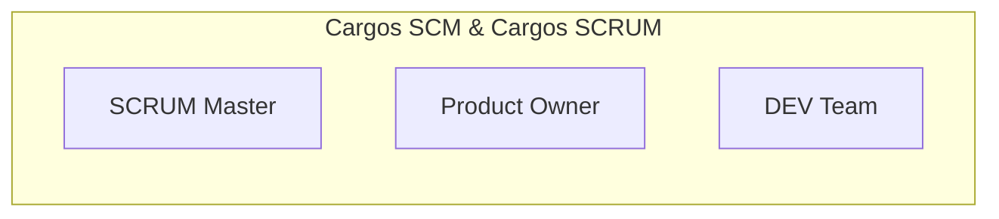
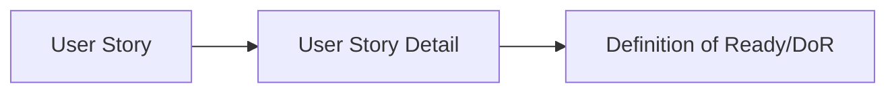
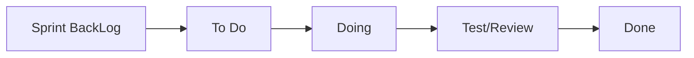
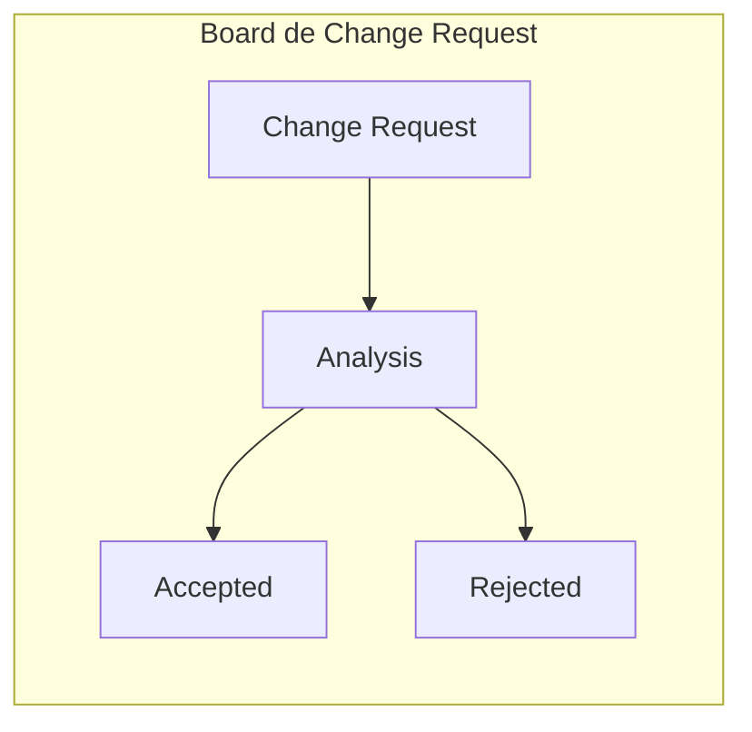

<h2>Laboratorio de desenvolvimento de software</h2> 

<h2>Ano Lectivo de 2021/2022</h2> 

<h2>Trabalho Prático</h2> 

 

# Software Configuration Management Plan  

|  Documento Identificador| Versão |    Data |Autores| Número Mecanográfico|
| ------ | ------ |------ |------ |------ |
| SCMPlanTrashTalk | 1.0 | 22 de Outubro de 2021 | Flavio Costa | 8130247 |
| SCMPlanTrashTalk | 1.1 | 01 de Dezembro de 2021 | Flavio Costa | 8130247 |

## Tabela de Conteúdos  
  
**[1. Introdução](#heading--1)**  
  
  * [1.1. Âmbito](#heading--1-1)  
  * [1.2. Definições, Acrónimos e Abreviações](#heading--1-2)  
  * [1.3. Referências](#heading--1-3)  
  
**[2. Gestão de Configuração de Software](#heading--2)**  
  
  * [2.1. Definição de cargos](#heading--2-1)  
  * [2.2. Organização e Responsabilidades](#heanding--2-2)  
  
      * [2.2.1. Planeamento](#heading--2-2-1)  
      * [2.2.2. Desenvolvimento](#heading--2-2-2)  
  
  * [2.3. Ferramentas, Ambiente e Infraestruturas](#heading--2-3)  
  
**[3. Programa de Gestão de Configuração de Software](#heading--3)**  
  
  * [3.1. Apresentação e Objetivos](#heading--3-1)  
  * [3.2. Standards, Convenções e Abordagens Adotadas](#heading--3-2)  

      * [3.2.1. Gestão das branches](#heading--3-2-1)  
      * [3.2.2. Nomenclaturas de métodos, variáveis e classes](#heading--3-2-2)  
  
  * [3.3. Atividades do SCM](#heading--3-3)  
  
      * [3.3.1. Identificação de Configuração](#heading--3-3-1)  
      * [3.3.2. Controlo de Alterações](#heading--3-3-2)  
      * [3.3.3. Auditorias e revisões](#heading--3-3-3)  
  
**[4. Milestones](#heading--4)**  
  
**[5. Requisitos e Recursos de Utilização](#heading--5)**  
  
---  
  
  
<a name="heading--1"/>  
  
# 1. Introdução  
  
  
<a name="heading--1-1"/>  
  
### 1.1. Âmbito  
  O *Software Configuration Plan* serve para a definição de um conjunto de convenções, normas e regras que a equipa de desenvolvimento deve ter seguir em diferentes fase e ações do ciclo de vida de um software. A metodologia que irá modelar este ciclo de vida e processo de desenvolvimento de software é SCRUM o que influenciará a forma com que algumas atividades do SCM serão descritas neste documento. Milestones darão lugar a *Sprints* e requisitos mais associados a User Stories.
  
<a name="heading--1-2"/>  

### 1.2. Definições, acrónimos e abreviações  
  DoR-Definition of Ready  

    
  
  
<a name="heading--1-3"/>  
  
### 1.3. Referências  
  

<a name="heading--2"/>  
  
## 2. Gestão de Configuração de Software  
  
  
<a name="heading--2-1"/>  
  
### 2.1. Definição de cargos  
 
---  

Cargos Scrum:

 
---  

  
<a name="heading--2-2"/>  
  
### 2.2. Organização e Responsabilidades  

Todos os membros do projeto têm uma função atribuída de modo a uniformizar e a garantir a consistência de todas as atividades relativas à gestão da configuração de *software*. A metodologia *SCRUM* tem estabelecidos alguns papéis com funções bem definidas como *SCRUM Master*, *Product Owner*, *Dev Team*.
No desenvolvimento deste projeto, desde a definição de uma *User Story* até à sua conclusão, existem algumas regras e procedimentos que devem ser cumpridos para um maior controlo e qualidade de todo o processo de desenvolvimento. Este processo de desenvolvimento divide-se em duas grandes fase, planeamento e desenvolvimento. Com ajuda da ferramenta  Gitlab, não só garantimos o controlo de versões e automatização de processos e tarefas mas também vai possibilitar o desenvolvimento e monitorização de todo o progresso do projeto tendo por base a metodologia *SCRUM*.  
Por isso estas duas fases, vão se traduzir em duas *Boards*:  
  
#### 2.2.1. Board Planning <a name="heading--2-2-1"/>  
  
Cada *board* tem as suas *labels* que definem diferentes etapas da *User Story Task*.  

---  
  

 
---  
  
As *labels* acima descritas correspondem a diferentes fases do planeamento das *User Stories*. Esta fase do planeamento descreve todo o processo de definição das *User Stories*. Na *Sprint Planning Meeting*, onde estarão presentes *Scrum Master, Product Owner e Dev Team,* será definido o *backlog* inicial, e serão discutidas quais as *User Stories* que irão ser desenvolvidas de modo a satisfazer as necessidades do cliente. No fim desta reunião o *backlog*inicial fica definido e deverá ser inserido no GitLab com a *label User Story*. No entanto, ainda é necessária uma maior análise para detalhar os critérios de aceitação e as tarefas que vão estar associadas à *User Story*, então neste momento o estado da *User Story* deverá ser atualizado para *User Story Detail*. Depois de todas as *User Stories* terem o esforço e prioridade estimados, a narrativa e as critérios também definidos, o *Product Owner* responsável pela gestão do *Backlog*, irá fazer uma última revisão e, depois de completamente definida e detalhada, passará para o estado de *Definition of Ready(DoR)*. Apenas podem ser adicionadas *User Stories* à *Sprint Backlog* com a *label* associada de *DoR(Definition of Ready)*.  
  
Para estimativa do esforço será utilizada uma escala de *S*,*M*,*L* para definição do esforço da *User Story*. Será utilizada a técnica de *Planning Poker* durante a *Sprint Planning Meeting* para estimar este esforço. Todas as decisões tomadas e discutidas tanto durante o desenvolvimento do projeto como nos meetings planeados estarão documentados no plano de desenvolvimento.  

  
<a name="heading--2-2-2"/>  
  
#### 2.2.2. Board Development  
 
---  
  

 
---  
  
As *labels* acima descritas correspondem a diferentes fases do desenvolvimento das *User Stories*. No *Sprint Planning Meeting* são discutidas as *User Stories* do *Backlog List* depois de serem definidas como prontas (DoR) pelo *Product Owner*. 
Desta lista são retiradas aquelas que serão necessárias implementar no próximo *Sprint*, e colocadas com a *label Sprint Backlog*. 
Neste momento, estando as User Stories definidas a *DEV Team* poderá começar a desenvolver as suas tarefas, associando as tarefas com mais prioridade com a *label To Do*.No momento na inicizalização da User Story, a pessoa responsável pelo desenvolvimento atualiza a label da issue para Doing. 
Cada membro da *DEV Team* deverá criar uma branch única para cada funcionalidade/tarefa. Para mais informações consultar documentação relativa a gestão e utilização das *branchs* ( [3.2.1. Gestão das branches](#heading--3-2-1) ). Se por algum motivo os cinco elementos não conseguirem desenvolver tarefas simultaneamente, os restantes elementos poderão tratar da documentação que estará a ser desenvolvida no momento. Depois de desenvolvida a funcionalidade a pessoa responsável para test/review atualiza a label da issue para test/review. Depois de efetuados os testes review, se os critérios de aceitação foram todos cumpridos a issue será fechada e colocada com label Done, se algum critério não tiver sido cumprido é criado um change request de modo a resolver o problema. O *Scrum Master* deve supervisionar todos os passos anteriores para assegurar uma utilização adequada da metodologia *SCRUM*.
  
  
<a name="heading--2-3"/>  
  
### 2.3. Ferramentas, Ambiente e Infraestruturas  
  
No desenvolvimento *agile* é importante o uso de ferramentas que permitam auxiliar o desenvolvimento do projeto de forma a automatizar tarefas, processos e reduzir alguns passos manuais onde poderiam ocorrer erros ou falhas humanas. As ferramentas que vão ser utilizadas para suportar o plano SCM são:
- **GitLab** (Para controlo de versões do código fonte, documentação e desenvolvimento do projeto como recurso às metodologias *agile* (*SCRUM*);
- **JUnit 5 Jupiter** (Para realização de testes unitários);
- **Microsoft Visual Studio** (Para realização de testes unitários e desenvolvimento do back-end);
- **Android Studio** *(Para desenvolvimento do código mobile)*.
- **Azure** *(Para para utilização de uma maquina virtual do SQLServer)*.

Durante o desenvolvimento do projeto existem 3 artefactos que devem ser atualizados e revistos (Plano SCM, Desenvolvimento e testes). O plano SCM deve ser definido no ínicio do projeto e pode aperfeiçoado ao decorrer do projeto e do *feedback* das *retrospective meetings*. O plano de desenvolvimento regista a atividade SCM do controlo de alterações e atas de todos os *meetings* realizados. Já o plano de testes descreve a análise e resultado dos testes implementados.   
Uma ferramenta essencial no desenvolvimento e gestão de todo o processo de desenvolvimento de software deste projeto será o Gitlab. Para além de servir de repositório, será também uma ferramenta colaborativa na medida que oferece ferramentas que permitem assegurar grande parte das atividades do plano SCM como controlo de versões, através do repositório GIT, controlo de alterações através da Issue Tracker, configuração da identificação com a utilização de tags e integração continua através de Runners que executam ficheiro .gitlab-ci.yml.  
  
<a name="heading--3"/>  
  
## 3. Programa de Gestão de Configuração de Software  
  
  
<a name="heading--3-1"/>  
  
### 3.1. Apresentação e Objetivos  

Nesta secção vão ser definidos convenções, nomenclaturas e procedimentos no desenvolvimento por parte da *Dev Team*. Desde a forma como gerimos e damos o nome ás *branches* até à nomenclatura dos métodos e classes, todos os desenvolvedores devem seguir o padrão definido aqui no plano.  
  
  
<a name="heading--3-2"/>  
  
### 3.2. Standards, Convenções e Abordagens Adotadas  
  
  
<a name="heading--3-2-1"/>  
  
#### 3.2.1 Gestão das branches  
  
O projeto terá uma *branch Master* que depois de definida a *baseline* de configuração inicial, não é permitido *push* de dados de nenhum elemento do grupo para garantir a estabilidade do projeto.
Para cada funcionalidade a ser desenvolvida ou pedido de alteração a ser resolvido deve ser criada uma *branch* apenas para o efeito. Uma *branch* para desenvolvimento de *features* deve ter o prefixo de feature/ seguido de estilo CamelCase, começando por letra minúscula. Exemplo: feature/loadFileJson.  
Uma branch para tratar de uma *Change Request* deve ter o prefixo de changeRequest/ e seguido do mesmo estilo adotado anteriormente. Exemplo: "changeRequest/fixLoadFileJson".
Cada elemento a trabalhar na branch secundária da *feature/change request* deve, no limite, fazer um *commit* ao final de um dia de trabalho.  
  
  
<a name="heading--3-2-2"/>  
  
#### 3.2.2 Nomenclaturas de métodos, user stories, variáveis e classes  
  
Os métodos, variáveis e classes devem ser definidos com estilo *CamelCase* e a primeira letra minúscula e escritos em inglês. Exemplo: addContainer().
Constantes deve ser definidas apenas com letra maiúscula. Exemplo: ` final int MAXCAPACITY = 10 `. Todos os métodos e classes devem ser documentados (Javadoc) no momento da sua implementação.  
A criação de uma *User Story* deve ter a seguinte estrutura, "[User Story] - Como 'utilizador', devo ser capaz de 'ação' de modo a 'evento'". Para a  *User Story* passar da fase de *User Story Detail* para *DoR(Definition of Ready)* deve ter descrito também quais os criterios de aceitação e as tarefas associadas.  
Para a criação de uma *User Story Task* deverá ser seguida a seguinte estrutura, "[User Story Task #(Referência à *User Story*)] - Tarefa 1".  

  
<a name="heading--3-3"/>  
  
### 3.3. Atividades do SCM  
  
  
<a name="heading--3-3-1"/>  
  
#### 3.3.1. Identificação de Configuração  

A identificação de componentes é a forma como identificamos cada versão e através dele,
é possível perceber em que estado se encontra o componente. O padrão adotado na 
númeração dos componentes irá ser o *Major Minor Patch*,
onde *Major* significa uma alteração bastante significativa no projeto, normalmente 
corresponde ao final de um *sprint*. *Minor* corresponderá a uma nova funcionalidade, 
ou seja um incremento menos significativo, não alterando em demasia o *software*. Por fim, 
o *Patch* corresponde a pequenas alterações como correção de *bugs*, ou modificações na documentação. Cada modificação na identificação  
  
  
<a name="heading--3-3-2"/>  
  
#### 3.3.2. Controlo de Alterações  

O *Product Owner* é responsável pela gestão dos pedidos de alterações que podem ser provenientes da *DEV Team*, resultantes de erros encontrados ou de testes falhados. Estes pedidos têm de ter associado uma *label Change Request*, que serão posteriormente analisados pelo *Product Owner*, que irá aferir a viabilidade dos mesmos. Posteriormente, se for aceite, será criada uma *issue* e enviada á *DEV Team* para ser desenvolvida. Na descrição desta nova *issue* deverá referênciar o pedido de alteração para garantir uma melhor interligação de todo o processo. Existirá no GitLab a *Board Change Request* de modo a monitorizar todo este processo. Também devem ser registados no plano de desnvolvimento os pedidos de alteração que devem ter o seguinte formato:  

| ID Change Request | Descrição | Fonte | Data | Análise | Decisão Final | Responsável |
| -- | --------- | ----- | ---- | ------- | ------------- | ----------- |
|  |  |  |  |  |  | |

<a name="heading--3-3-3"/>  
  
#### 3.3.3. Auditorias e revisões 
A própria metodologia Scrum permite auditorias e revisões aos processos através das retrospective e review meeting.      

---

  ## 4. Milestones  
Enquadrando este plano SCM ao desenvolvimento de software com base nas metodologias agéis, cada milestone irá corresponder a um sprint. Em cada milestone fecha-se um ciclo e inicia-se novamente um novo com novas adaptações tanto no processo como no produto com base no feedback tanto do cliente como da equipa. Devem ser convocadas reuniões (Sprint Planning, Review, Retrospective Meeting, para permitir aperfeiçoamento continuo do processo a cada milestone. Relativamente ao produto, no final de uma Milestone à necessidade de entrega de um software com um incremento significativo relativamente à milestone anterior. 
   
 

    
  
             

       
