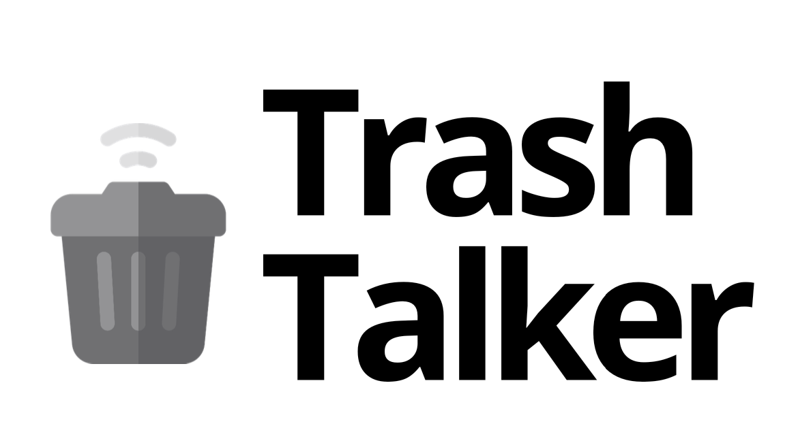

# Trabalho Prático de Laboratorio de desenvolvimento de Software

# TrashTalker
Este projeto consiste em uma aplicação que seja capaz de gerir e monitorizar contentores de uma empresa de residuos, para isso serão utilizados sensores que façam o controlo de fluxo dentro do contentor, registando em tempo real o estado do contentor (percentagem de enchimento), facilitando assim a forma como as rotas serão realizadas.

:articulated_lorry: Sistema de monitorização de pontos de recolha de residuos :articulated_lorry:

## **Como Iniciar o Projeto?**

Para iniciar o projeto devem ser seguidos os seguintes passos:  
1. Verificar que a connection string utilizada no projeto (Backend/TrashTalker/appSettings.Development.json) é:  
    `"DBConnection": "Server=localhost;Database=trashTalker;User=sa;Password=MyPass@word"`
2. Criar um docker container com a imagem de SQL que esteja em conformidade com a connection string:  
    `docker run -e "ACCEPT_EULA=1" -e "MSSQL_SA_PASSWORD=MyPass@word" -e "MSSQL_USER=sa" -p 1433:1433 -d --name=sql mcr.microsoft.com/mssql/server:2019-latest`
3. Iniciar o container: `docker start sql`
4. Iniciar o backend: `dotnet build` e `dotnet run`
5. Instalar dependências e iniciar o frontend: `npm install` e deseguida `npm start`
  

## **Ferramentas**

* **GitLab** – Controlo de versões, definição e distribuição das tarefas atribuídas aos elementos da equipa
* **Microsoft Teams** – Plataforma de comunicação dos elementos da equipa
* **Zoom** - Plataforma de comunicação dos elementos da equipa

## **Tecnologias**

* **Angular** - Framework para lado do cliente
* **Android** - Sistema operativo utilizado pelo cliente no dispositvo mobile
* **.NET** - Plataforma de desenvolvimento da WEB API
* **SQL** - Base de dados relacional utilizada para o armazenamento dos dados
* **Arduino IOT Cloud** - Serviço IoT da cloud utilizado para comunicação com os sensores

## **Equipa**

* João Lopes
* Tiago Leite
* João Bragança
* Micael Sampaio
* Flávio Costa

## **Arquitetura do projeto**

### **Escola Superior de Tecnologia e Gestão - P.Porto**
